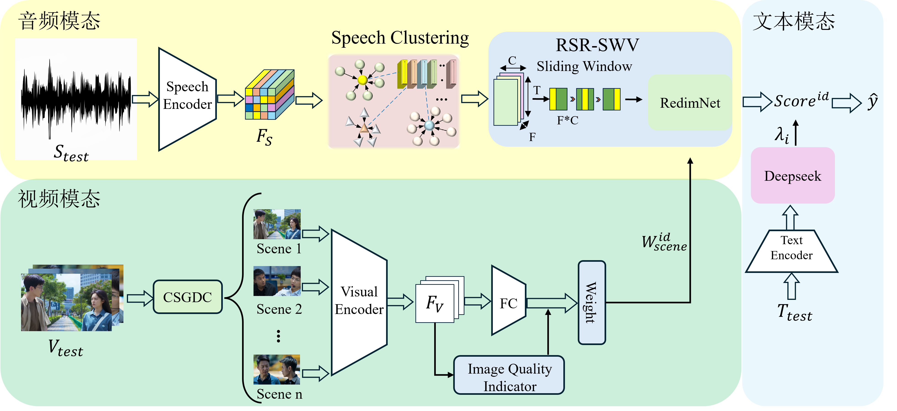

# TV_speaker_recognition
# 电视剧说话人识别竞赛

<div align="center">
  
  <br>
  <small>基于深度学习的电视剧角色语音识别系统</small>
</div>

## 📖 项目概述

第七届中国研究生人工智能创新大赛参赛作品
“声”临其境：多模态驱动的智能台词标注系统 
针对传统字幕制作中台词对齐依赖人工、误差率高的痛点，我们提出了一种多模态驱动的智能台词标注系统。系统融合语音识别、说话人聚类、人脸追踪，实现了音视频信息的深度互补。技术上，我们设计了前后文场景驱动的对话分组与约束聚类机制，解决了短音频切分不准和多人重叠语音的鲁棒性问题；引入滑动窗口+投票机制，显著降低了噪声干扰导致的识别偏差；并结合大语言模型的上下文因果校正，提升了台词与角色匹配的语义一致性。实验表明，在国产电视剧《开端》数据集中，说话人准确率达到81.52%，结合各模块作用展开消融实验，均显著优于现有单模态方案。该方法具备良好的通用性与可扩展性，为影视后期、短视频生成等应用提供了高效、智能的解决方案。 

"Immersive Sound": A Multimodal-Driven Intelligent Dialogue Annotation System
Addressing the pain points of traditional subtitle production, such as manual-dependent dialogue alignment and high error rates, we propose a multimodal-driven intelligent dialogue annotation system. The system integrates speech recognition, speaker clustering, and face tracking to achieve deep complementarity of audio-visual information. Technically, we designed a contextually scene-driven dialogue grouping and constrained clustering mechanism to resolve the robustness issues of inaccurate short audio segmentation and multi-speaker overlapping speech. The introduction of a sliding window and voting mechanism significantly reduces recognition deviations caused by noise interference. Combined with contextual causal correction leveraging large language models, the semantic consistency between dialogues and character matching is enhanced. Experiments on the dataset of the Chinese TV series Reset demonstrate a speaker recognition accuracy of 81.52%. Ablation studies on the roles of each module show significant improvements over existing unimodal solutions. The method exhibits strong generalizability and scalability, providing an efficient and intelligent solution for applications such as film and television post-production and short video generation.


## 🚀 快速开始

### 环境要求

- Python 3.8+
- PyTorch 1.9+
- CUDA 11.0+ 

### 安装依赖

```bash
pip install -r requirements.txt


### 训练模型
```bash
python  /root/main.py


### 🗂 项目结构
text
project/
├── configs/          # 配置文件
├── data/             # 数据目录
├── models/           # 模型定义
├── utils/            # 工具函数
├── scripts/          # 训练和评估脚本
├── images/           # 图片资源
├── requirements.txt  # 依赖列表
└── README.md         # 项目说明

### 👥 贡献者
- [Merhan Lee](https://github.com/qjmltz)
- [Ruixi Ran](https://github.com/MagiaClay)


### 🙏 致谢
感谢 [redimnet](https://github.com/redimnet) 和 [adaface](https://github.com/adaface) 提供的宝贵资源和代码参考！

感谢第七届中国研究生人工智能创新大赛以及华为企业提供平台！


